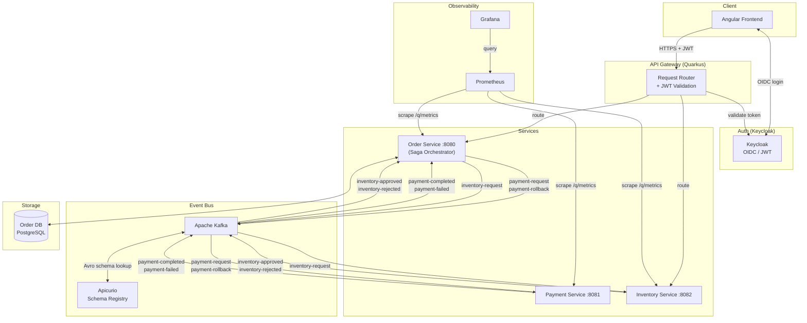

# ShopFlow – Microservices Platform

          [](https://github.com/panryba/shop-microservices/actions/workflows/ci.yml)

---

## Overview

A production-shaped online shop built as a microservices portfolio project, demonstrating distributed systems patterns and operational concerns found in modern backend architectures.

- **Architecture** — Hexagonal Architecture, Domain-Driven Design, API Gateway
- **Reliability** — Saga Orchestrator, Transactional Outbox, Idempotent Consumer (Inbox), Dead Letter Queue, Saga Timeout, Idempotent Order Creation, Fault Tolerance, Concurrency Control
- **Messaging** — Avro + Schema Registry, Partition Key Consistency, Correlation ID Tracing
- **Observability** — Micrometer, Prometheus, Loki, Grafana

### Create Order Flow

```
Angular Frontend
       │
       ▼
API Gateway → Keycloak
       │
       ▼
Order Service → PostgreSQL
       │
       ▼
     Kafka
  ┌────┴────┐
  ▼         ▼
Payment  Inventory
Service  Service
```


---

## Quick Start

> Requires [Docker](https://docs.docker.com/get-docker/) and Docker Compose. No Java, Maven, or Node installation needed.

```bash
git clone https://github.com/panryba/shop-microservices.git
cd shop-microservices
docker compose up
```

**Endpoints:**

| Endpoint | URL |
|----------|-----|
| Frontend | http://localhost:4200 |
| API Gateway | http://localhost:8090 |
| Gateway Swagger UI | http://localhost:8090/q/swagger-ui |
| Keycloak Admin | http://localhost:8180/admin (admin / password) |
| Grafana (metrics + logs) | http://localhost:3000 |
| Prometheus | http://localhost:9090 |

**Default users** (pre-seeded in Keycloak):

| Username | Password | Role |
|----------|----------|------|
| user1 | password | user |
| admin | password | admin |

---

## Architecture



---

## Patterns Implemented

### Architecture

#### Hexagonal Architecture (Ports & Adapters)
The `order-service` is structured in three layers with strict dependency direction (inward only):
- Domain — pure Java, no framework dependencies
- Application — use cases and saga orchestration, depends only on domain
- Infrastructure — Kafka, JPA, outbox, inbox; implements the output ports defined by the application layer

Payment and inventory services are intentionally thin — their sole responsibility is to simulate an external system responding to events.

#### Domain-Driven Design
The `order-service` domain layer models the business explicitly: `Order` is the aggregate root, `OrderItem` is a child entity, `Money` and `OrderId` are value objects, and `OrderStatus` is a state enum. No Quarkus, JPA, or Kafka annotation touches this layer. Infrastructure concerns (persistence, messaging) implement ports defined by the application layer and depend inward — never the other way around.

#### API Gateway
A dedicated Quarkus service (port 8090) acts as the single entry point for all clients. It routes `/api/orders/**` to the order-service and `/api/inventory/mode` to the inventory-service via typed REST clients.

The gateway generates or propagates `X-Correlation-ID` on every request and forwards it to downstream services, enabling distributed tracing across synchronous HTTP requests and asynchronous Kafka events.

Downstream response headers are filtered before being returned to clients to prevent HTTP framing conflicts. Unreachable downstream services map to `502 Bad Gateway`; open circuits return `503 Service Unavailable`; downstream `4xx` responses pass through with their original status code.

### Reliability

#### Saga Orchestrator
The `order-service` owns the entire order lifecycle and drives every step explicitly. It decides what happens next based on each response — no choreography, no implicit coupling between services. The saga state (`WAITING_PAYMENT` → `WAITING_INVENTORY` → `COMPLETED` / `CANCELLED`) is persisted in the database, making it recoverable after a restart.

#### Transactional Outbox
The orchestrator never publishes to Kafka directly inside a business transaction. Instead it writes an `outbox` row in the same transaction as the domain change. A scheduled publisher reads pending rows and publishes them to Kafka, then marks them sent. This eliminates the dual-write problem: if the service crashes after committing the DB transaction but before publishing, the outbox row survives and will be retried. Outbox publishing is idempotent — retries may result in duplicate sends, which are handled by idempotent consumers (Inbox pattern).

#### Idempotent Consumer (Inbox)
The system operates under at-least-once delivery semantics — all consumers must be idempotent. Every Kafka event handler records the `eventId` in an `inbox_events` table before processing. On redelivery, the duplicate is detected and silently skipped. This makes all consumers safe to retry without risk of double-charging, double-approving, or double-cancelling.

#### Dead Letter Queue
Each consumer is configured with retry and dead-letter-queue fallback. Failed message processing is retried automatically; after repeated failures the event is moved to a dedicated `<topic>-dlq` topic and the consumer continues processing subsequent messages without blocking.

#### Saga Timeout
A scheduled timeout process runs every 10 seconds and finds sagas where the step deadline has passed (30 seconds per step). Timed-out `WAITING_PAYMENT` sagas cancel the order. Timed-out `WAITING_INVENTORY` sagas cancel the order and trigger a `payment-rollback` to reverse the charge. This prevents orders from being stuck in a pending state forever if a downstream service is unavailable.

#### Idempotent Order Creation
`POST /orders` accepts an optional `Idempotency-Key: <uuid>` header. The client generates the UUID before sending and retries safely if the network times out — the order-service checks whether that key was already processed and returns the existing order ID instead of creating a duplicate. The key is stored as a unique-constrained column on the `orders` table. Concurrent duplicate requests are resolved safely using a database unique constraint with fallback lookup logic. The key is echoed back in the response `Idempotency-Key` header.

#### Fault Tolerance
All gateway-to-downstream calls are protected by MicroProfile Fault Tolerance. Read and idempotent write operations are retried up to 3 times with a short delay between attempts — retries abort immediately on 4xx responses so client errors are never retried. POST (create order) is not retried as the operation is not idempotent. All downstream calls are protected by a circuit breaker that opens after 50% failures across 10 requests and remains open for 5 seconds; once open, requests fail fast with `503 SERVICE_UNAVAILABLE` without hitting the downstream service. REST clients are configured with connect and read timeouts to bound worst-case latency.

#### Concurrency Control
Concurrent updates are retried automatically after optimistic locking conflicts. This prevents silent data corruption under concurrent load without resorting to pessimistic locking.

### Messaging

#### Avro + Schema Registry
All Kafka messages are serialized with Apache Avro against schemas registered in Apicurio Schema Registry. Schemas are auto-registered on first publish. This enforces a contract between producers and consumers and enables schema evolution without breaking existing consumers.

#### Partition Key Consistency
Every outgoing Kafka message is keyed by `orderId`. Kafka guarantees that all messages with the same key are routed to the same partition and consumed in order. This means all events for a single order — `payment-request`, `payment-completed`, `inventory-request`, `inventory-approved` — are processed sequentially by the consumer, with no risk of out-of-order state transitions.

#### Correlation ID Tracing
Every request receives an `X-Correlation-ID` header (generated if absent). It is propagated as a Kafka record header on every outgoing event and extracted by every consumer. All log lines include `corrId` and `orderId` via MDC, making it possible to trace a single order flow across synchronous HTTP requests and asynchronous saga events.

---

## JWT Authentication

JWT signature validation is enforced at the gateway only. Downstream services trust the forwarded token and use it only for identity extraction and authorization context. The gateway uses `quarkus-oidc` with Keycloak as the OIDC provider. Unauthenticated requests return `401`; insufficient role returns `403` — both as structured `GatewayErrorResponse` JSON.

The raw `Authorization: Bearer <token>` header is forwarded downstream so services can extract user identity without re-validating the token against Keycloak. Role-based access: order endpoints require any authenticated user; `PUT /api/inventory/mode` requires admin role.

The order-service derives customer identity directly from the JWT subject claim — `customerId` is never trusted from the request body. The `sub` claim is a UUID and serves as the authoritative customer identifier for every order. The `preferred_username` claim is persisted with the order at creation time to avoid cross-service user lookups.

---

## Delivery Guarantees

| Concern | Guarantee |
|---------|-----------|
| Messaging | At-least-once |
| Outbox | Eventual delivery — survives crashes, retried until published |
| Inbox | Idempotent processing — duplicates detected and discarded |
| Saga | Eventual consistency — every step is recoverable or compensated |

---

## Services

| Service | Port | Responsibility |
|---------|------|----------------|
| gateway | 8090 | API Gateway — single entry point, routes to downstream services, propagates Correlation ID |
| order-service | 8080 | Saga orchestrator, order lifecycle, REST API |
| payment-service | 8081 | Simulates payment processing |
| inventory-service | 8082 | Simulates inventory availability check |
| frontend | 4200 | Angular SPA (served by nginx in Docker) |

---

## Saga Flow

### Happy Path

```
Client           Order Service        Payment Service    Inventory Service
  |                    |                    |                   |
  |-- POST /orders --> |                    |                   |
  |                    |-- payment-request->|                   |
  |                    |<-payment-completed-|                   |
  |                    |-- inventory-request------------------->|
  |                    |<-inventory-approved--------------------|
  |                    |                                        |
  |              status: COMPLETED                              |
```

### Payment Failure

```
Order Service  →  payment-request  →  Payment Service
               ←  payment-failed   ←
Order cancelled, no rollback needed (payment never charged)
```

### Inventory Rejection

```
Order Service  →  inventory-request  →  Inventory Service
               ←  inventory-rejected ←
Order Service  →  payment-rollback   →  Payment Service
Order cancelled, payment reversed
```

### Timeout

```
A scheduled process detects deadline exceeded (every 10s, 30s deadline per step)
  WAITING_PAYMENT   → cancel order
  WAITING_INVENTORY → cancel order + payment-rollback
```

---

## Simulating Failures

All failure scenarios can be toggled from the **Admin Panel** in the frontend (`/admin`, requires admin role).

To trigger failures via API directly, obtain an admin token first:

```bash
ADMIN_TOKEN=$(curl -s -X POST http://localhost:8180/realms/shopflow/protocol/openid-connect/token \
  -d "grant_type=password&client_id=shopflow-app&username=admin&password=password" \
  | jq -r .access_token)
```

**Payment rejection** — disable payment acceptance, then place any order:
```bash
PUT http://localhost:8090/api/payment/mode?accept=false   # Authorization: Bearer $ADMIN_TOKEN
PUT http://localhost:8090/api/payment/mode?accept=true    # restore
```

**Inventory rejection** — set inventory to reject mode, then place any order:
```bash
PUT http://localhost:8090/api/inventory/mode?accept=false   # Authorization: Bearer $ADMIN_TOKEN
PUT http://localhost:8090/api/inventory/mode?accept=true    # restore
```

**Payment consumer crash → DLQ** — enable crash mode, then place any order. The payment consumer throws on every attempt; after 5 retries the message lands in `payment-request-dlq`. The saga times out after 30 s and cancels the order.
```bash
PUT http://localhost:8090/api/payment/crash?enabled=true    # Authorization: Bearer $ADMIN_TOKEN
PUT http://localhost:8090/api/payment/crash?enabled=false   # restore
```

**Inventory consumer crash → DLQ** — same as above but for the inventory step. The message lands in `inventory-request-dlq` and a `payment-rollback` is triggered before cancellation.
```bash
PUT http://localhost:8090/api/inventory/crash?enabled=true  # Authorization: Bearer $ADMIN_TOKEN
PUT http://localhost:8090/api/inventory/crash?enabled=false # restore
```

---

## API Reference

All endpoints served by the API Gateway at `http://localhost:8090/api`.  
Auth: `Bearer` token required. Order endpoints: any authenticated user. Payment and inventory controls (mode, crash, delay): `admin` role only.

Full interactive contract: **http://localhost:8090/q/swagger-ui**

| Method | Endpoint | Description |
|--------|----------|-------------|
| POST | `/api/orders` | Place a new order — starts the saga asynchronously, returns `202 Accepted` with `Location` header |
| GET | `/api/orders` | List orders — users see own orders, admins see all |
| GET | `/api/orders/{id}` | Single order with full status history |
| GET | `/api/orders/{id}/events` | SSE stream — pushes status transitions, closed on terminal state |
| PUT | `/api/orders/{id}/cancel` | Cancel order — triggers `payment-rollback` if payment already charged |
| | **Admin controls** | |
| PUT | `/api/payment/mode` | Toggle payment acceptance (`?accept=false`) |
| PUT | `/api/inventory/mode` | Toggle inventory acceptance (`?accept=false`) |
| PUT | `/api/payment/crash` | Enable payment consumer crash mode (`?enabled=true`) |
| PUT | `/api/inventory/crash` | Enable inventory consumer crash mode (`?enabled=true`) |
| PUT | `/api/payment/delay` | Slow down payment consumer (`?seconds=0\|2\|4\|6\|8`) |
| PUT | `/api/inventory/delay` | Slow down inventory consumer (`?seconds=0\|2\|4\|6\|8`) |

**Order statuses:** `CREATED` → `PAID` → `INVENTORY_APPROVED` (success) / `PAYMENT_FAILED` / `INVENTORY_REJECTED` → `CANCELLED`

> `customerId` is extracted from the JWT `sub` claim — never trusted from the request body.

> `price` is accepted from the client as a pragmatic simplification — in production it would come from a product catalog service.

---

## Frontend

The Angular 21 SPA is served by nginx on port 4200 in Docker. It communicates exclusively through the API Gateway.

**Pages:**

| Page | Path | Access |
|------|------|--------|
| Order List | `/orders` | all authenticated users |
| Order Detail | `/orders/:id` | order owner or admin |
| New Order | `/orders/new` | all authenticated users |
| Admin Panel | `/admin` | admin role only |

**Authentication** — Login via Keycloak OIDC Authorization Code flow. The JWT access token is attached to every API request automatically. Unauthenticated users are redirected to the Keycloak login page; users without admin role are redirected away from the admin route.

**Order List** — paginated table with Order ID (truncated to 13 chars, full UUID on hover), customer username, status badge, creation date, item count, and total. All users see all their own orders; admins see all orders from all users.

**Order Detail** — full saga timeline (one entry per status transition with icon, colour, and timestamp), items table with album artwork, and a "Live" indicator while the saga is still in progress. Status updates are streamed via SSE and the stream closes automatically when the saga reaches a terminal state.

**New Order** — product catalogue of vinyl albums with cover art, quantity selector, running cart total, and idempotent checkout (client-generated `Idempotency-Key` header).

**Admin Panel** — three control cards, all require `admin` role:
- **Acceptance modes** — separate toggles for the inventory and payment consumers; disable either to force all requests to be rejected regardless of inventory state
- **Saga step delay** — per-service delay dropdowns (0 s / 2 s / 4 s / 6 s / 8 s); slows the payment or inventory consumer so each status transition is visible in the live saga timeline during a demo
- **Failure simulation** — crash mode toggles for the payment and inventory consumers; when enabled the consumer throws on every message, triggering 5 retries and moving the message to the DLQ; the saga times out after 30 s and cancels the order; visible in the Grafana ERROR stream and DLQ event count panel

**UI library** — PrimeNG.

---

## Kafka Topics

| Topic | Producer | Consumer |
|-------|----------|----------|
| `payment-request` | order-service | payment-service |
| `payment-completed` | payment-service | order-service |
| `payment-failed` | payment-service | order-service |
| `payment-rollback` | order-service | payment-service |
| `payment-rollback-completed` | payment-service | order-service |
| `inventory-request` | order-service | inventory-service |
| `inventory-approved` | inventory-service | order-service |
| `inventory-rejected` | inventory-service | order-service |

Each topic has a corresponding DLQ: `<topic>-dlq`.

---

## Tech Stack

| Layer | Technology |
|-------|-----------|
| Runtime | Quarkus 3.33, Java 25 |
| Frontend | Angular 21, PrimeNG 21, nginx |
| Messaging | Apache Kafka 4.1.1, SmallRye Reactive Messaging |
| Serialization | Apache Avro 1.12.1, Apicurio Schema Registry 3.1.7 |
| Database | PostgreSQL 18, Hibernate ORM Panache, Flyway |
| Resilience | MicroProfile Fault Tolerance (retry, DLQ) |
| Auth | Keycloak 26, quarkus-oidc, MicroProfile JWT |
| Observability | Micrometer, Prometheus 3.11, Loki 3.7.0, Grafana Alloy 1.8.1, Grafana 13.0 |
| API | JAX-RS, OpenAPI / Swagger UI |
| Infrastructure | Docker, Docker Compose, GitHub Actions |

---

## Observability

All services expose Prometheus metrics via Micrometer on `/q/metrics`. Grafana Alloy ships Docker container logs to Loki. Grafana is provisioned automatically with Prometheus and Loki datasources plus four pre-built dashboards.

The observability stack focuses on business-level saga visibility in addition to infrastructure and JVM metrics.

Custom metrics cover saga outcomes (created, completed, failed, compensated, timed out), saga duration by outcome, outbox pending lag, inbox duplicates blocked, and payment and inventory acceptance rates.

Four Grafana dashboards are provisioned automatically:

- **Saga & Orders** — saga counter tiles, health time series (started vs completed vs failed), success rate %, average saga duration by outcome and order creation rate (increase over 5 min)
- **Kafka & Messaging** — payment and inventory acceptance/rejection counters and rate trends
- **Logs (Loki)** — correlation-ID-based distributed trace panel, live orchestrator and gateway log streams, ERROR stream per service, and per-service log volume
- **System Health** — outbox pending lag, inbox duplicates, DLQ event counts, JVM heap, GC pause rate, HTTP request and error rates at the gateway

**Correlation ID tracing** — the Logs dashboard accepts a Correlation ID and instantly shows the full saga flow across all services in chronological order. The Order Detail page links directly to Grafana pre-filtered to that correlation ID.

**Observability stack:**

| Tool | Port | Role |
|------|------|------|
| Prometheus | 9090 | Scrapes Micrometer metrics from all services every 5 s |
| Loki | 3100 | Centralized log aggregation |
| Alloy | — | Ships Docker container logs to Loki |
| Kafka Exporter | 9308 | Exposes Kafka topic offsets and DLQ topics as Prometheus metrics |
| Grafana | 3000 | Pre-provisioned with Prometheus + Loki datasources and four ShopFlow dashboards |

---

## CI/CD

Every push to `master` triggers the pipeline. Pull requests run build and test only — no push to Docker Hub.


Images pushed: `tbzowka/{order-service,payment-service,inventory-service,gateway,frontend}:latest`

---

## Tests

```bash
cd order-service   && ./mvnw test   # 46 tests
cd payment-service && ./mvnw test   # 4 tests
cd inventory-service && ./mvnw test # 3 tests
```

**order-service** — `@QuarkusTest` integration tests with Testcontainers (Postgres, Kafka, Apicurio Schema Registry spun up automatically):
- Full saga flows: happy path, inbox idempotency, saga timeout, inventory rejection + payment compensation
- HTTP contract: input validation (400), unknown order (404)
- Outbox publisher: retry logic, batch size limit, routing per event type

**payment-service / inventory-service** — Mockito unit tests on the event consumers: accepted, rejected, crash mode (nack).

### E2E Tests (Playwright)

Three browser-level scenarios that test the full stack end to end. Require the complete stack to be running (`docker compose up -d`).

```bash
cd frontend
npm run e2e         # headless
npx playwright test --headed   # with browser visible
npx playwright show-report     # open HTML report after a run
```

| # | Scenario | What it proves |
|---|----------|----------------|
| 1 | **Happy path** | Login → add item → place order → saga timeline builds (Order Created → Payment Confirmed → Inventory Reserved) → order appears in list with correct status |
| 2 | **Failure path** | Admin enables inventory rejection → place order → compensation saga runs (Inventory Rejected → Payment Rolled Back) → status shows Inventory Rejected |
| 3 | **Unauthenticated** | Navigating to `/orders` without a token redirects to Keycloak login page |

> E2E tests are not wired into CI — they require the full infrastructure (Keycloak, Kafka, all services). Run locally after `docker compose up -d`.

---

## Roadmap

- [x] **Docker Compose** — single `docker compose up` to run all services, Kafka, Apicurio, PostgreSQL
- [x] **GitHub Actions CI/CD** — build, test, push Docker images to Docker Hub on merge to master
- [x] **API Gateway** — Quarkus REST Client proxy, single entry point, Correlation ID propagation, 502 error handling
- [x] **Authentication** — Keycloak OIDC, JWT validation at gateway, role-based access control, JWT forwarded downstream
- [x] **Angular Frontend** — order list, order detail with live saga timeline, checkout with vinyl catalogue, admin panel; PrimeNG UI, nginx in Docker
- [x] **Observability** — Micrometer metrics, Prometheus, Loki + Grafana Alloy log aggregation, four Grafana dashboards provisioned automatically; Correlation ID distributed tracing via dedicated Loki dashboard
- [x] **Integration Tests** — `@QuarkusTest` + Testcontainers; full saga flows, HTTP contract validation, outbox publisher; Playwright E2E tests for happy path, failure path, and auth