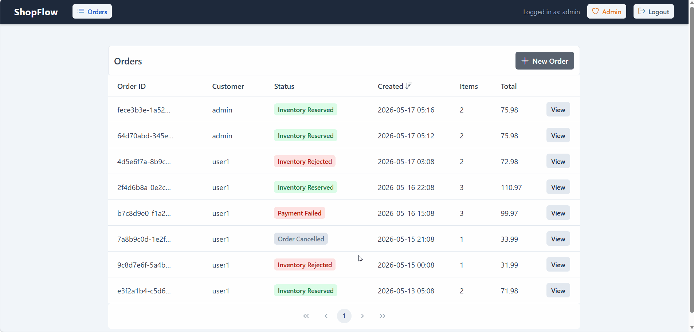
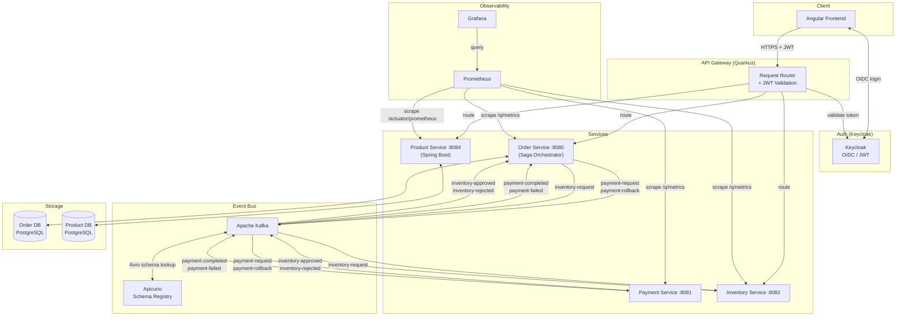
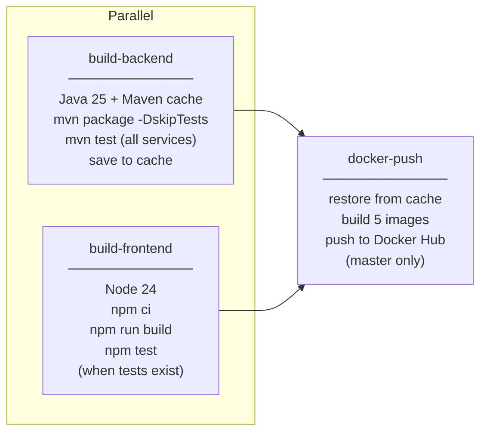

# ShopFlow – Microservices Platform

           [](https://github.com/panryba/shopflow/actions/workflows/ci.yml)

---

## Overview

A production-shaped online shop built as a microservices portfolio project, demonstrating distributed systems patterns and operational concerns found in modern backend architectures.

- **Architecture** — Hexagonal Architecture, Domain-Driven Design, API Gateway
- **Reliability** — Saga Orchestrator, Transactional Outbox, Idempotent Consumer (Inbox), Dead Letter Queue, Saga Timeout, Idempotent Order Creation, Fault Tolerance, Concurrency Control
- **Messaging** — Avro + Schema Registry, Partition Key Consistency, Correlation ID Tracing
- **Observability** — Micrometer, Prometheus, Loki, Grafana

### Create Order Flow

```
Angular Frontend
       │
       ▼
API Gateway → Keycloak
       │
       ▼
Order Service → PostgreSQL
       │
       ▼
     Kafka
  ┌────┴────┐
  ▼         ▼
Payment  Inventory
Service  Service
```



---

## Quick Start

> Requires [Docker](https://docs.docker.com/get-docker/) and Docker Compose. No Java, Maven, or Node installation needed.

```bash
git clone https://github.com/panryba/shopflow.git
cd shopflow
docker compose up
```

**Endpoints:**

| Endpoint | URL |
|----------|-----|
| Frontend | http://localhost:4200 |
| API Gateway | http://localhost:8090 |
| Gateway Swagger UI | http://localhost:8090/q/swagger-ui |
| Keycloak Admin | http://localhost:8180/admin (admin / password) |
| Grafana (metrics + logs) | http://localhost:3000 |
| Prometheus | http://localhost:9090 |

**Default users** (pre-seeded in Keycloak):

| Username | Password | Role |
|----------|----------|------|
| user1 | password | user |
| admin | password | admin |

---

## Architecture



---

## Patterns Implemented

### Architecture

#### Hexagonal Architecture (Ports & Adapters)
The `order-service` is structured in three layers with strict dependency direction (inward only):
- Domain — pure Java, no framework dependencies
- Application — use cases and saga orchestration, depends only on domain
- Infrastructure — Kafka, JPA, outbox, inbox; adapters implement output ports where abstraction is meaningful

No Quarkus, JPA, or Kafka annotations appear in the domain layer. Infrastructure implements ports defined by the application layer and depends inward — never the other way around.

Output ports are defined for repository access and history recording. Cross-cutting concerns such as metrics, inbox idempotency, and outbox reliability are injected directly into the application layer, avoiding unnecessary abstractions.

Payment and inventory services are intentionally thin and exist solely to simulate external systems responding to events.

#### Domain-Driven Design
The `order-service` domain layer models the business explicitly: `Order` is the aggregate root, `OrderItem` is a child entity, `Money` and `OrderId` are value objects, and `OrderStatus` is a state enum. The `Order` aggregate enforces all state transitions internally. Methods such as `pay()`, `approveInventory()`, and `failPayment()` guard against invalid transitions and throw if the current status is unexpected. Business rules live in the domain, not in services or consumers.

#### API Gateway
A dedicated Quarkus service acts as the single entry point for all clients. It routes requests to downstream services via typed REST clients and exposes administrative control endpoints requiring the `admin` role.

The gateway generates or propagates `X-Correlation-ID` on every request and forwards it downstream, enabling tracing across synchronous HTTP requests and asynchronous Kafka events.

Unreachable downstream services map to `502 Bad Gateway`, open circuits return `503 Service Unavailable`, and downstream HTTP error responses pass through with their original status code.

### Reliability

#### Saga Orchestrator
The `order-service` owns the entire order lifecycle and drives every step explicitly. It decides what happens next based on each response — no choreography, no implicit coupling between services. The saga state (`WAITING_PAYMENT` → `WAITING_INVENTORY` → `COMPLETED` / `WAITING_ROLLBACK` → `CANCELLED`) is persisted in the database, making it recoverable after a restart. `WAITING_ROLLBACK` exists because payment is charged before inventory is checked — if inventory rejects, the charge must be reversed before the order can be cancelled.

#### Transactional Outbox
The orchestrator never publishes to Kafka directly inside a business transaction. Instead it writes an `outbox` row in the same transaction as the domain change. A scheduled publisher reads pending rows and publishes them to Kafka, then marks them sent. This eliminates the dual-write problem: if the service crashes after committing the DB transaction but before publishing, the outbox row survives and will be retried.

Outbox publishing produces at-least-once delivery — retries after a crash may result in duplicate sends, which the Inbox pattern handles on the consumer side. The outbox query uses `FOR UPDATE SKIP LOCKED` so concurrent pods never pick up the same rows. Failed publishes increment a retry counter and record the last error. Events that exhaust all retries are flagged as dead: the readiness health check flips unhealthy and an ERROR is logged every minute — both visible in Grafana. Dead events are retained until the cleanup window expires rather than deleted immediately, allowing manual investigation.

#### Idempotent Consumer (Inbox)
Every Kafka event handler records the `eventId` in an `inbox_event` table before processing. Duplicate deliveries are detected and skipped, making consumers safe under at-least-once delivery semantics.

The inbox insert runs in the same transaction as the business logic, flushed immediately to acquire a row lock before any business logic runs. If the outer transaction rolls back for any reason, the inbox row disappears with it — leaving a clean state for the next attempt.

#### Dead Letter Queue
Failures are handled in two tiers that both compose correctly with the inbox. Transient optimistic lock conflicts are retried immediately at the application level — a fast local retry is more appropriate than waiting for Kafka to redeliver the message. If application-level retries are exhausted, the conflict falls through to the Kafka tier. All other failures skip straight to exponential-backoff Kafka retries. After all Kafka retries are exhausted the message is moved to a dedicated `<topic>-dlq` topic and the consumer continues without blocking.

#### Saga Timeout
A scheduled timeout job runs every 10 seconds and finds sagas whose step deadline has passed (configurable, 30 seconds by default).
- Timed-out `WAITING_PAYMENT` sagas cancel the order.
- Timed-out `WAITING_INVENTORY` sagas cancel the order and trigger a `payment-rollback`, then wait in `WAITING_ROLLBACK` for confirmation.
- Timed-out `WAITING_ROLLBACK` sagas force-cancel without waiting for rollback confirmation — this is a deliberate trade-off: the order is cancelled even though the payment may not have been reversed yet, accepting a potential inconsistency in exchange for never being stuck indefinitely.

All timeouts increment a dedicated metric visible in Grafana. The saga query uses `FOR UPDATE SKIP LOCKED` so multiple pods never process the same expired saga concurrently. Completed and cancelled saga records are cleaned up after a configurable retention window.

#### Idempotent Order Creation
`POST /orders` accepts an optional `Idempotency-Key: <uuid>` header. The client generates the UUID before sending and retries safely if the network times out — the order-service checks whether that key was already processed and returns the existing order ID instead of creating a duplicate. The key is stored as a unique-constrained column on the `orders` table and echoed back in the response header. Requests without a key are processed independently.

#### Fault Tolerance
All gateway-to-downstream calls are protected by MicroProfile Fault Tolerance. Read and idempotent write operations are retried on network-level failures — retries abort immediately on any HTTP response, since the circuit breaker handles repeated server errors. POST (create order) is not retried as the idempotency key is optional — without it, retrying could produce duplicate orders. All downstream calls are protected by a circuit breaker that opens after 50% failures across 10 requests and remains open for 5 seconds; once open, requests fail fast with `503 SERVICE_UNAVAILABLE` without hitting the downstream service. REST clients are configured with connect and read timeouts to bound worst-case latency.

#### Concurrency Control
The `Order` aggregate uses optimistic locking — every update verifies the entity hasn't been modified by another transaction since it was read. Conflicts are retried automatically on both HTTP endpoints and Kafka consumers. After repeated conflicts an HTTP request fails with a conflict error; a Kafka consumer falls through to the DLQ path. This prevents silent data corruption under concurrent load without resorting to pessimistic locking.

### Messaging

#### Avro + Schema Registry
All Kafka messages are serialized with Apache Avro against schemas registered in Apicurio Schema Registry. Schemas are defined as `.avsc` files and code-generated into typed Java classes. This enforces a contract between producers and consumers and enables backward-compatible schema evolution.

#### Partition Key Consistency
Every outgoing Kafka message is keyed by `orderId`. Within each topic, all messages for the same order always land on the same partition and are processed by the same consumer instance — preventing concurrent processing of events for the same order.

Because the saga is strictly sequential — each step is only published after the previous one completes — only one message per order is ever in flight at a time, so events are always processed in the correct order.

Each downstream service has its own consumer group. Kafka delivers every message to each group independently, so adding more instances of a service scales throughput without messages being skipped or duplicated.

#### Correlation ID Tracing
Every request receives an `X-Correlation-ID` header (generated if absent). It is propagated as an HTTP header on downstream calls and as a Kafka record header on outgoing events, and extracted by every consumer. All services include `corrId` and `orderId` (when applicable) in log entries via MDC, making it possible to trace a single request flow across synchronous HTTP calls and asynchronous Kafka events. The ID is echoed back in the response header so it can be used for Grafana log lookups.

---

## JWT Authentication

JWT validation is enforced at the gateway, the order-service, and the product-service. The gateway validates via Keycloak OIDC, while the order-service and product-service validate independently against Keycloak's public key rather than blindly trusting forwarded credentials. Unauthenticated requests return `401 Unauthorized`; insufficient permissions return `403 Forbidden`.

The `Authorization` header is forwarded downstream so services can extract user identity from the token. Order endpoints require authentication, while administrative endpoints require the `admin` role.

The order-service derives customer identity directly from the JWT subject claim — `customerId` is never trusted from the request body. The `preferred_username` claim is persisted with the order at creation time to avoid cross-service user lookups.

---

## Delivery Guarantees

| Concern | Guarantee |
|---------|-----------|
| Messaging | At-least-once |
| Outbox | Eventual delivery — survives crashes, retried until published |
| Inbox | Idempotent processing — duplicates detected and discarded |
| Saga | Eventual consistency — every step is recoverable or compensated |

---

## Services

| Service | Port | Responsibility |
|---------|------|----------------|
| gateway | 8090 | API Gateway — single entry point, routes to downstream services, propagates Correlation ID |
| order-service | 8080 | Saga orchestrator, order lifecycle, REST API |
| payment-service | 8081 | Simulates payment processing |
| inventory-service | 8082 | Simulates inventory availability check |
| product-service | 8084 | Product catalogue — Spring Boot service with Spring Batch CSV import |
| frontend | 4200 | Angular SPA (served by nginx in Docker) |

---

## Saga Flow

### Happy Path

```
Client           Order Service        Payment Service    Inventory Service
  |                    |                    |                   |
  |-- POST /orders --> |                    |                   |
  |                    |-- payment-request->|                   |
  |                    |<-payment-completed-|                   |
  |                    |-- inventory-request------------------->|
  |                    |<-inventory-approved--------------------|
  |                    |                                        |
  |              status: COMPLETED                              |
```

### Payment Failure

```
Order Service  →  payment-request  →  Payment Service
               ←  payment-failed   ←
Order cancelled, no rollback needed (payment never charged)
```

### Inventory Rejection

```
Order Service  →  inventory-request  →  Inventory Service
               ←  inventory-rejected ←
Order Service  →  payment-rollback   →  Payment Service
Order cancelled, payment reversed
```

### Timeout

```
A scheduled process detects deadline exceeded (every 10s, 30s deadline per step)
  WAITING_PAYMENT   → cancel order
  WAITING_INVENTORY → cancel order + payment-rollback
```

---

## Simulating Failures

All failure scenarios can be toggled from the **Admin Panel** in the frontend (`/admin`, requires admin role).

To trigger failures via API directly, obtain an admin token first:

```bash
ADMIN_TOKEN=$(curl -s -X POST http://localhost:8180/realms/shopflow/protocol/openid-connect/token \
  -d "grant_type=password&client_id=shopflow-app&username=admin&password=password" \
  | jq -r .access_token)
```

**Payment rejection** — disable payment acceptance, then place any order:
```bash
PUT http://localhost:8090/api/payment/mode?accept=false   # Authorization: Bearer $ADMIN_TOKEN
PUT http://localhost:8090/api/payment/mode?accept=true    # restore
```

**Inventory rejection** — set inventory to reject mode, then place any order:
```bash
PUT http://localhost:8090/api/inventory/mode?accept=false   # Authorization: Bearer $ADMIN_TOKEN
PUT http://localhost:8090/api/inventory/mode?accept=true    # restore
```

**Payment consumer crash → DLQ** — enable crash mode, then place any order. The payment consumer throws on every attempt; after 5 retries the message lands in `payment-request-dlq`. The saga times out after 30 s and cancels the order.
```bash
PUT http://localhost:8090/api/payment/crash?enabled=true    # Authorization: Bearer $ADMIN_TOKEN
PUT http://localhost:8090/api/payment/crash?enabled=false   # restore
```

**Inventory consumer crash → DLQ** — same as above but for the inventory step. The message lands in `inventory-request-dlq` and a `payment-rollback` is triggered before cancellation.
```bash
PUT http://localhost:8090/api/inventory/crash?enabled=true  # Authorization: Bearer $ADMIN_TOKEN
PUT http://localhost:8090/api/inventory/crash?enabled=false # restore
```

---

## API Reference

All endpoints served by the API Gateway at `http://localhost:8090/api`.  
Auth: `Bearer` token required. Order endpoints: any authenticated user. Payment and inventory controls (mode, crash, delay) and product import: `admin` role only.

Full interactive contract: **http://localhost:8090/q/swagger-ui**

| Method | Endpoint | Description |
|--------|----------|-------------|
| POST | `/api/orders` | Place a new order — starts the saga asynchronously, returns `202 Accepted` with `Location` header |
| GET | `/api/orders` | List orders — users see own orders, admins see all |
| GET | `/api/orders/{id}` | Single order with full status history |
| GET | `/api/orders/{id}/events` | SSE stream — pushes status transitions, closed on terminal state |
| PUT | `/api/orders/{id}/cancel` | Cancel order — triggers `payment-rollback` if payment already charged |
| | **Admin controls** | |
| PUT | `/api/payment/mode` | Toggle payment acceptance (`?accept=false`) |
| PUT | `/api/inventory/mode` | Toggle inventory acceptance (`?accept=false`) |
| PUT | `/api/payment/crash` | Enable payment consumer crash mode (`?enabled=true`) |
| PUT | `/api/inventory/crash` | Enable inventory consumer crash mode (`?enabled=true`) |
| PUT | `/api/payment/delay` | Slow down payment consumer (`?seconds=0\|2\|4\|6\|8`) |
| PUT | `/api/inventory/delay` | Slow down inventory consumer (`?seconds=0\|2\|4\|6\|8`) |
| | **Product catalogue** | |
| GET | `/api/products` | List all products |
| POST | `/api/products/import` | Import product catalogue from CSV — replaces the full catalogue |

**Order statuses:** `CREATED` → `PAID` → `INVENTORY_APPROVED` (success) / `PAYMENT_FAILED` / `INVENTORY_REJECTED` → `CANCELLED`

> `customerId` is extracted from the JWT `sub` claim — never trusted from the request body.

> `price` is accepted from the client as a pragmatic simplification — in production it would come from a product catalog service.

---

## Frontend

The Angular 21 SPA is served by nginx on port 4200 in Docker. It communicates exclusively through the API Gateway.

**Pages:**

| Page | Path | Access |
|------|------|--------|
| Order List | `/orders` | all authenticated users |
| Order Detail | `/orders/:id` | order owner or admin |
| New Order | `/orders/new` | all authenticated users |
| Admin Panel | `/admin` | admin role only |

**Authentication** — Login via Keycloak OIDC Authorization Code flow. The JWT access token is attached to every API request automatically. Unauthenticated users are redirected to the Keycloak login page; users without admin role are redirected away from the admin route.

**Order List** — paginated table with Order ID (truncated to 13 chars, full UUID on hover), customer username, status badge, creation date, item count, and total. All users see all their own orders; admins see all orders from all users.

**Order Detail** — full saga timeline (one entry per status transition with icon, colour, and timestamp), items table with album artwork, and a "Live" indicator while the saga is still in progress. Status updates are streamed via SSE and the stream closes automatically when the saga reaches a terminal state.

**New Order** — product catalogue of vinyl albums with cover art, quantity selector, running cart total, and idempotent checkout (client-generated `Idempotency-Key` header).

**Admin Panel** — four control cards, all require `admin` role:

- **Product Catalogue** — CSV file upload that triggers a Spring Batch import job; replaces the full catalogue on each run; shows imported and skipped record counts
- **Acceptance modes** — separate toggles for inventory and payment consumers; force requests to be rejected regardless of inventory state
- **Saga step delay** — per-service delay controls (0–8 s); slows payment or inventory processing so saga transitions are visible in the live timeline during demonstrations
- **Failure simulation** — crash mode for payment and inventory consumers; forces retries, DLQ routing, and eventual saga timeout; visible in Grafana logs and metrics

**UI library** — PrimeNG.

---

## Kafka Topics

| Topic | Producer | Consumer |
|-------|----------|----------|
| `payment-request` | order-service | payment-service |
| `payment-completed` | payment-service | order-service |
| `payment-failed` | payment-service | order-service |
| `payment-rollback` | order-service | payment-service |
| `payment-rollback-completed` | payment-service | order-service |
| `inventory-request` | order-service | inventory-service |
| `inventory-approved` | inventory-service | order-service |
| `inventory-rejected` | inventory-service | order-service |

Each topic has a corresponding DLQ: `<topic>-dlq`.

---

## Tech Stack

| Layer | Technology |
|-------|-----------|
| Runtime | Quarkus 3.33, Spring Boot 4.0.6, Java 25 |
| Frontend | Angular 21, PrimeNG 21, nginx |
| Messaging | Apache Kafka 4.1.1, SmallRye Reactive Messaging |
| Serialization | Apache Avro 1.12.1, Apicurio Schema Registry 3.1.7 |
| Database | PostgreSQL 18, Hibernate ORM Panache, Spring Data JPA, Flyway |
| Batch | Spring Batch 6 |
| Resilience | MicroProfile Fault Tolerance |
| Auth | Keycloak 26, quarkus-oidc, MicroProfile JWT, Spring Security |
| Observability | Micrometer, Prometheus 3.11, Loki 3.7.0, Grafana Alloy 1.8.1, Grafana 13.0 |
| API | JAX-RS, OpenAPI / Swagger UI |
| Testing | JUnit 5, Mockito, Testcontainers, @QuarkusTest, @SpringBatchTest, Playwright |
| Infrastructure | Docker, Docker Compose, GitHub Actions |

---

## Observability

All services expose Prometheus metrics via Micrometer. Quarkus services expose metrics on `/q/metrics`; the Spring Boot product-service exposes them on `/actuator/prometheus`. Grafana Alloy ships Docker container logs to Loki. Grafana is provisioned automatically with Prometheus and Loki datasources plus four pre-built dashboards.

The observability stack focuses on business-level saga visibility in addition to infrastructure and JVM metrics.

Custom metrics cover saga outcomes (created, completed, failed, compensated, timed out), saga duration by outcome, outbox pending lag, inbox duplicates blocked, payment and inventory acceptance rates, plus Spring Batch import metrics from the product catalogue service.

Four Grafana dashboards are provisioned automatically:

- **Saga & Orders** — saga counter tiles, health time series (started vs completed vs failed), success rate %, average saga duration by outcome and order creation rate (increase over 5 min)
- **Kafka & Messaging** — payment and inventory acceptance/rejection counters and rate trends
- **Logs (Loki)** — correlation-ID-based distributed trace panel, live orchestrator and gateway log streams, ERROR stream per service, and per-service log volume
- **System Health** — product catalogue import counters (total runs, failures, records imported, records skipped), outbox pending lag, inbox duplicates, DLQ event counts, JVM heap, GC pause rate, HTTP request and error rates at the gateway

**Correlation ID tracing** — the Logs dashboard accepts a Correlation ID and instantly shows the full saga flow across all services in chronological order. The Order Detail page links directly to Grafana pre-filtered to that correlation ID.

**Observability stack:**

| Tool | Port | Role |
|------|------|------|
| Prometheus | 9090 | Scrapes Micrometer metrics from all services every 5 s |
| Loki | 3100 | Centralized log aggregation |
| Alloy | — | Ships Docker container logs to Loki |
| Kafka Exporter | 9308 | Exposes Kafka topic offsets and DLQ topics as Prometheus metrics |
| Grafana | 3000 | Pre-provisioned with Prometheus + Loki datasources and four ShopFlow dashboards |

---

## CI/CD

Every push to `master` triggers the pipeline. Pull requests run build and test only — no push to Docker Hub.



Images pushed: `tbzowka/{order-service,payment-service,inventory-service,product-service,gateway,frontend}:latest`

---

## Tests

```bash
cd order-service     && ./mvnw test   # 46 tests
cd payment-service   && ./mvnw test   # 4 tests
cd inventory-service && ./mvnw test   # 3 tests
cd product-service   && ./mvnw test   # 20 tests
```

**order-service** — `@QuarkusTest` integration tests with Testcontainers (PostgreSQL, Kafka, Apicurio Schema Registry):
- Full saga flows: happy path, inbox idempotency, saga timeout, inventory rejection with payment compensation
- HTTP contract: input validation (400), unknown order (404)
- Outbox publisher: retry logic, batch size limit, and event routing

**product-service** — unit and integration tests:
- CSV validation and parsing
- Spring Batch processing, skip handling, and catalogue replacement
- Import job execution with PostgreSQL Testcontainers
- REST API endpoints and file upload scenarios

**payment-service / inventory-service** — Mockito unit tests covering accepted, rejected, and crash-mode event processing.

### E2E Tests (Playwright)

Three browser-level scenarios that test the full stack end to end. Require the complete stack to be running (`docker compose up -d`).

```bash
cd frontend
npm run e2e         # headless
npx playwright test --headed   # with browser visible
npx playwright show-report     # open HTML report after a run
```

| # | Scenario | What it proves |
|---|----------|----------------|
| 1 | **Happy path** | Login → add item → place order → saga timeline builds (Order Created → Payment Confirmed → Inventory Reserved) → order appears in list with correct status |
| 2 | **Failure path** | Admin enables inventory rejection → place order → compensation saga runs (Inventory Rejected → Payment Rolled Back) → status shows Inventory Rejected |
| 3 | **Unauthenticated** | Navigating to `/orders` without a token redirects to Keycloak login page |

> E2E tests are not wired into CI — they require the full infrastructure (Keycloak, Kafka, all services). Run locally after `docker compose up -d`.

---

## Roadmap

- [x] **Docker Compose** — single `docker compose up` to run all services, Kafka, Apicurio, PostgreSQL
- [x] **GitHub Actions CI/CD** — build, test, push Docker images to Docker Hub on merge to master
- [x] **API Gateway** — Quarkus REST Client proxy, single entry point, Correlation ID propagation, 502 error handling
- [x] **Authentication** — Keycloak OIDC, JWT validation at gateway, role-based access control, JWT forwarded downstream
- [x] **Angular Frontend** — order list, order detail with live saga timeline, checkout with vinyl catalogue, admin panel; PrimeNG UI, nginx in Docker
- [x] **Observability** — Micrometer metrics, Prometheus, Loki + Grafana Alloy log aggregation, four Grafana dashboards provisioned automatically; Correlation ID distributed tracing via dedicated Loki dashboard
- [x] **Integration Tests** — `@QuarkusTest` + Testcontainers (order-service); `@SpringBatchTest` + Testcontainers PostgreSQL (product-service); full saga flows, HTTP contract validation, outbox publisher testing, CSV import workflows; Playwright E2E tests for happy path, failure path, and authentication
- [x] **Product Service** — Spring Boot 4.0.6 microservice; Spring Batch CSV import; product catalogue served via REST; admin-triggered import from the frontend; Database-per-Service (own PostgreSQL schema)