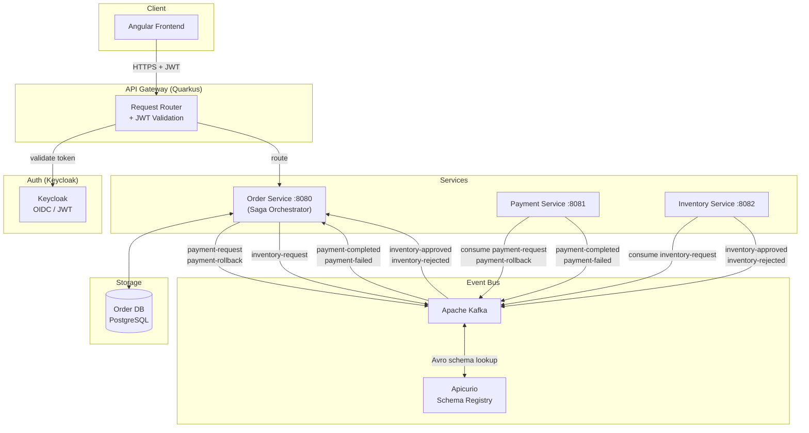

# ShopFlow – Microservices Platform

   

A production-shaped online shop built as a microservices portfolio project, demonstrating senior-level distributed systems patterns: **Saga Orchestrator**, **Transactional Outbox**, **Idempotent Consumer (Inbox)**, **Dead Letter Queue**, **Avro + Schema Registry**, and **Saga Timeout**.

---

## Architecture



> Components marked in italics (API Gateway, Keycloak, Angular) are planned — see [Roadmap](#roadmap).

---

## Patterns Implemented

### Saga Orchestrator
The `order-service` owns the entire order lifecycle and drives every step explicitly. It decides what happens next based on each response — no choreography, no implicit coupling between services. The saga state (`WAITING_PAYMENT` → `WAITING_INVENTORY` → `COMPLETED` / `CANCELLED`) is persisted in the database, making it recoverable after a restart.

### Transactional Outbox
The orchestrator never publishes to Kafka directly inside a business transaction. Instead it writes an `outbox` row in the same transaction as the domain change. A scheduled `OutboxPublisherJob` reads pending rows and publishes them to Kafka, then marks them sent. This eliminates the dual-write problem: if the service crashes after committing the DB transaction but before publishing, the outbox row survives and will be retried. Outbox publishing is idempotent — retries may result in duplicate sends, which are handled by idempotent consumers (Inbox pattern).

### Idempotent Consumer (Inbox)
The system operates under at-least-once delivery semantics — all consumers must be idempotent. Every Kafka event handler records the `eventId` in an `inbox_events` table before processing. On redelivery, the duplicate is detected and silently skipped. This makes all consumers safe to retry without risk of double-charging, double-approving, or double-cancelling.

### Dead Letter Queue
Each consumer channel is configured with `failure-strategy=dead-letter-queue`. Retries are handled via application-level `@Retry` and Kafka redelivery. After repeated failures, a poisoned message is moved to a `<topic>-dlq` topic and the consumer continues. Nothing blocks.

### Saga Timeout
A `SagaTimeoutJob` runs every 10 seconds and finds sagas where the step deadline has passed (30 seconds per step). Timed-out `WAITING_PAYMENT` sagas cancel the order. Timed-out `WAITING_INVENTORY` sagas cancel the order and trigger a `payment-rollback` to reverse the charge. This prevents orders from being stuck in a pending state forever if a downstream service is unavailable.

### Avro + Schema Registry
All Kafka messages are serialized with Apache Avro against schemas registered in Apicurio Schema Registry. Schemas are auto-registered on first publish. Each service owns its schema files under `src/main/avro/consumed/` and `src/main/avro/produced/`. This enforces a contract between producers and consumers and enables schema evolution without breaking existing consumers.

### Correlation ID Tracing
Every request receives an `X-Correlation-ID` header (generated if absent). It is propagated as a Kafka record header on every outgoing event and extracted by every consumer. All log lines include `corrId` and `orderId` via MDC, making it possible to trace a single order's full journey across all three services in aggregated logs.

### Hexagonal Architecture (Ports & Adapters)
The `order-service` is structured in three layers with strict dependency direction (inward only):
- **Domain** — pure Java, no framework dependencies
- **Application** — use cases and saga orchestration, depends only on domain
- **Infrastructure** — Kafka, JPA, outbox, inbox; implements the output ports defined by the application layer

Payment and inventory services are intentionally thin — their sole responsibility is to simulate an external system responding to events.

### Domain-Driven Design
The `order-service` domain layer models the business explicitly: `Order` is the aggregate root, `OrderItem` is a child entity, `Money` and `OrderId` are value objects, and `OrderStatus` is a state enum. No Quarkus, JPA, or Kafka annotation touches this layer. Infrastructure concerns (persistence, messaging) implement ports defined by the application layer and depend inward — never the other way around.

### Partition Key Consistency
Every outgoing Kafka message is keyed by `orderId`. Kafka guarantees that all messages with the same key are routed to the same partition and consumed in order. This means all events for a single order — `payment-request`, `payment-completed`, `inventory-request`, `inventory-approved` — are processed sequentially by the consumer, with no risk of out-of-order state transitions.

### Concurrency Control
All REST handlers and Kafka consumers in the `order-service` are annotated with `@Retry(retryOn = OptimisticLockException.class)`. If two concurrent requests attempt to update the same order or saga row simultaneously, JPA throws an `OptimisticLockException` and the operation is retried automatically with jitter. This prevents silent data corruption under concurrent load without resorting to pessimistic locking.

---

## Delivery Guarantees

| Concern | Guarantee |
|---------|-----------|
| Messaging | At-least-once |
| Outbox | Eventual delivery — survives crashes, retried until published |
| Inbox | Idempotent processing — duplicates detected and discarded |
| Saga | Eventual consistency — every step is recoverable or compensated |

---

## Services

| Service | Port | Responsibility |
|---------|------|----------------|
| order-service | 8080 | Saga orchestrator, order lifecycle, REST API |
| payment-service | 8081 | Simulates payment processing |
| inventory-service | 8082 | Simulates inventory availability check |

**Business rules (current simulation):**
- Payment service accepts orders where `amount < 1000`, rejects otherwise
- Inventory service always accepts (comment out the flag in `InventoryEventConsumer` to simulate rejection)

---

## Saga Flow

### Happy Path

```
Client          Order Service        Payment Service    Inventory Service
  |                   |                    |                   |
  |-- POST /orders --> |                   |                   |
  |                   |-- payment-request->|                   |
  |                   |<-payment-completed-|                   |
  |                   |-- inventory-request------------------->|
  |                   |<-inventory-approved--------------------|
  |                   |                                        |
  |              status: COMPLETED                              |
```

### Payment Failure

```
Order Service  →  payment-request  →  Payment Service
               ←  payment-failed   ←
Order cancelled, no rollback needed (payment never charged)
```

### Inventory Rejection

```
Order Service  →  inventory-request  →  Inventory Service
               ←  inventory-rejected ←
Order Service  →  payment-rollback   →  Payment Service
Order cancelled, payment reversed
```

### Timeout

```
SagaTimeoutJob detects deadline exceeded (every 10s, 30s deadline per step)
  WAITING_PAYMENT   → cancel order
  WAITING_INVENTORY → cancel order + payment-rollback
```

---

## API Reference

All endpoints served by **order-service** at `http://localhost:8080`.

Swagger UI available at `http://localhost:8080/q/swagger-ui` in dev mode.

### POST /orders
Place a new order. Starts the saga asynchronously.

**Request**
```json
{
  "customerId": "3fa85f64-5717-4562-b3fc-2c963f66afa6",
  "items": [
    { "productId": "7c9e6679-7425-40de-944b-e07fc1f90ae7", "quantity": 2, "price": 74.99 }
  ]
}
```

> `price` per item is accepted from the client as a pragmatic simplification — in a production system it would be fetched from a product catalog service and never trusted from the client.

**Response** `202 Accepted`
```
Location: /orders/{orderId}
```

### GET /orders
Returns all orders.

### GET /orders/{id}
Returns a single order.

**Response** `200 OK`
```json
{
  "id": "3fa85f64-5717-4562-b3fc-2c963f66afa6",
  "status": "COMPLETED",
  "items": [
    { "productId": "7c9e6679-7425-40de-944b-e07fc1f90ae7", "quantity": 2, "price": 74.99 }
  ],
  "total": 149.98
}
```

**Order statuses:** `PENDING` → `PAID` → `COMPLETED` / `CANCELLED`

### PUT /orders/{id}/cancel
Manually cancel an order.

**Response** `204 No Content`

---

## Kafka Topics

| Topic | Producer | Consumer |
|-------|----------|----------|
| `payment-request` | order-service | payment-service |
| `payment-completed` | payment-service | order-service |
| `payment-failed` | payment-service | order-service |
| `payment-rollback` | order-service | payment-service |
| `inventory-request` | order-service | inventory-service |
| `inventory-approved` | inventory-service | order-service |
| `inventory-rejected` | inventory-service | order-service |

Each topic has a corresponding DLQ: `<topic>-dlq`.

---

## Tech Stack

| Layer | Technology |
|-------|-----------|
| Runtime | Quarkus 3.33, Java 21 |
| Messaging | Apache Kafka, SmallRye Reactive Messaging |
| Serialization | Apache Avro, Apicurio Schema Registry |
| Database | PostgreSQL 16, Hibernate ORM Panache, Flyway |
| Resilience | MicroProfile Fault Tolerance (retry, DLQ) |
| API | JAX-RS, OpenAPI / Swagger UI |

---

## Roadmap

- [ ] **Docker Compose** — single `docker-compose up` to run all services, Kafka, Zookeeper, Apicurio, PostgreSQL
- [ ] **API Gateway** — Quarkus reverse proxy, single entry point for the Angular app
- [ ] **Authentication** — Keycloak OIDC, JWT propagation through all services
- [ ] **Angular Frontend** — product listing, shopping cart, checkout, real-time order status via SSE
- [ ] **GitHub Actions CI/CD** — build, test, push Docker images to Docker Hub on merge to master
- [ ] **Observability** — Prometheus metrics, Grafana dashboard; key metrics: outbox lag, DLQ size, saga duration, order throughput
- [ ] **Integration Tests** — `@QuarkusTest` + Testcontainers, happy path saga E2E, inbox idempotency verification
