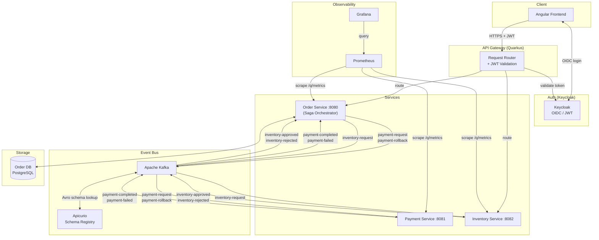

# ShopFlow – Microservices Platform

          [](https://github.com/panryba/shop-microservices/actions/workflows/ci.yml)

A production-shaped online shop built as a microservices portfolio project, demonstrating senior-level distributed systems patterns: **Hexagonal Architecture**, **Domain-Driven Design**, **Saga Orchestrator**, **Transactional Outbox**, **Idempotent Consumer (Inbox)**, **Dead Letter Queue**, **Saga Timeout**, **Avro + Schema Registry**, **Partition Key Consistency**, **Correlation ID Tracing**, **Concurrency Control**, **Idempotent Order Creation**, **API Gateway**, **Fault Tolerance**, **JWT Authentication**, and **Observability**.

---

## Quick Start

> Requires [Docker](https://docs.docker.com/get-docker/) and Docker Compose. No Java, Maven, or Node installation needed.

```bash
git clone https://github.com/panryba/shop-microservices.git
cd shop-microservices
docker compose up
```

| Endpoint | URL |
|----------|-----|
| Frontend | http://localhost:4200 |
| API Gateway | http://localhost:8090 |
| Gateway Swagger UI | http://localhost:8090/q/swagger-ui |
| Keycloak Admin | http://localhost:8180/admin (admin / password) |
| Grafana (metrics + logs) | http://localhost:3000 |
| Prometheus | http://localhost:9090 |

**Default users** (pre-seeded in Keycloak):

| Username | Password | Role |
|----------|----------|------|
| user1 | password | user |
| admin | password | admin |

---

## Architecture



---

## Patterns Implemented

### Hexagonal Architecture (Ports & Adapters)
The `order-service` is structured in three layers with strict dependency direction (inward only):
- **Domain** — pure Java, no framework dependencies
- **Application** — use cases and saga orchestration, depends only on domain
- **Infrastructure** — Kafka, JPA, outbox, inbox; implements the output ports defined by the application layer

Payment and inventory services are intentionally thin — their sole responsibility is to simulate an external system responding to events.

### Domain-Driven Design
The `order-service` domain layer models the business explicitly: `Order` is the aggregate root, `OrderItem` is a child entity, `Money` and `OrderId` are value objects, and `OrderStatus` is a state enum. No Quarkus, JPA, or Kafka annotation touches this layer. Infrastructure concerns (persistence, messaging) implement ports defined by the application layer and depend inward — never the other way around.

### Saga Orchestrator
The `order-service` owns the entire order lifecycle and drives every step explicitly. It decides what happens next based on each response — no choreography, no implicit coupling between services. The saga state (`WAITING_PAYMENT` → `WAITING_INVENTORY` → `COMPLETED` / `CANCELLED`) is persisted in the database, making it recoverable after a restart.

### Transactional Outbox
The orchestrator never publishes to Kafka directly inside a business transaction. Instead it writes an `outbox` row in the same transaction as the domain change. A scheduled `OutboxPublisherJob` reads pending rows and publishes them to Kafka, then marks them sent. This eliminates the dual-write problem: if the service crashes after committing the DB transaction but before publishing, the outbox row survives and will be retried. Outbox publishing is idempotent — retries may result in duplicate sends, which are handled by idempotent consumers (Inbox pattern).

### Idempotent Consumer (Inbox)
The system operates under at-least-once delivery semantics — all consumers must be idempotent. Every Kafka event handler records the `eventId` in an `inbox_events` table before processing. On redelivery, the duplicate is detected and silently skipped. This makes all consumers safe to retry without risk of double-charging, double-approving, or double-cancelling.

### Dead Letter Queue
Each consumer channel is configured with `failure-strategy=dead-letter-queue`. Retries are handled via application-level `@Retry` and Kafka redelivery. After repeated failures, a poisoned message is moved to a `<topic>-dlq` topic and the consumer continues. Nothing blocks.

### Saga Timeout
A `SagaTimeoutJob` runs every 10 seconds and finds sagas where the step deadline has passed (30 seconds per step). Timed-out `WAITING_PAYMENT` sagas cancel the order. Timed-out `WAITING_INVENTORY` sagas cancel the order and trigger a `payment-rollback` to reverse the charge. This prevents orders from being stuck in a pending state forever if a downstream service is unavailable.

### Avro + Schema Registry
All Kafka messages are serialized with Apache Avro against schemas registered in Apicurio Schema Registry. Schemas are auto-registered on first publish. Each service owns its schema files under `src/main/avro/consumed/` and `src/main/avro/produced/`. This enforces a contract between producers and consumers and enables schema evolution without breaking existing consumers.

### Partition Key Consistency
Every outgoing Kafka message is keyed by `orderId`. Kafka guarantees that all messages with the same key are routed to the same partition and consumed in order. This means all events for a single order — `payment-request`, `payment-completed`, `inventory-request`, `inventory-approved` — are processed sequentially by the consumer, with no risk of out-of-order state transitions.

### Correlation ID Tracing
Every request receives an `X-Correlation-ID` header (generated if absent). It is propagated as a Kafka record header on every outgoing event and extracted by every consumer. All log lines include `corrId` and `orderId` via MDC, making it possible to trace a single order flow across synchronous HTTP requests and asynchronous saga events.

### Concurrency Control
All REST handlers and Kafka consumers in the `order-service` are annotated with `@Retry(retryOn = OptimisticLockException.class)`. If two concurrent requests attempt to update the same order or saga row simultaneously, JPA throws an `OptimisticLockException` and the operation is retried automatically with jitter. This prevents silent data corruption under concurrent load without resorting to pessimistic locking.

### Idempotent Order Creation
`POST /orders` accepts an optional `Idempotency-Key: <uuid>` header. The client generates the UUID before sending and retries safely if the network times out — the order-service checks whether that key was already processed and returns the existing order ID instead of creating a duplicate. The key is stored as a unique-constrained column on the `orders` table. A concurrent duplicate (race condition where two requests pass the pre-check simultaneously) is caught via `PersistenceException` cause-chain inspection, with the fallback lookup running in a separate `REQUIRES_NEW` transaction to bypass the poisoned outer transaction. The key is echoed back in the response `Idempotency-Key` header.

### API Gateway
A dedicated Quarkus service (port 8090) acts as the single entry point for all clients. It routes `/api/orders/**` to the order-service and `/api/inventory/mode` to the inventory-service via typed MicroProfile REST Client proxy interfaces. The gateway generates or propagates `X-Correlation-ID` on every inbound request (server-side `ContainerRequestFilter`) and attaches it to every outgoing downstream call (client-side `ClientRequestFilter` registered via `@RegisterProvider`). Downstream responses are rebuilt before returning to the client — hop-by-hop headers (`transfer-encoding`, `content-length`, `host`, `connection`) are stripped to prevent HTTP framing conflicts. Unreachable downstream services map to `502 Bad Gateway`; open circuit returns `503 Service Unavailable`; 4xx errors from downstream pass through with their original status code.

### Fault Tolerance
All gateway-to-downstream calls are protected by MicroProfile Fault Tolerance. Read and idempotent write operations use `@Retry(maxRetries = 3, delay = 200ms)` — retries abort immediately on `WebApplicationException` so 4xx responses are never retried. POST (create order) gets no retry as the operation is not idempotent. All operations are protected by `@CircuitBreaker(requestVolumeThreshold = 10, failureRatio = 0.5, delay = 5s, successThreshold = 2)` — after 50% failures across 10 requests the circuit opens for 5 seconds; once open, requests fail fast with `503 SERVICE_UNAVAILABLE` and a structured `GatewayErrorResponse` without hitting the downstream service. REST clients are configured with a 1s connect timeout and 3s read timeout to bound worst-case latency on the local/Docker network.

### Observability
Prometheus metrics are exposed on `/q/metrics` by all four services (including the gateway) via Micrometer. Grafana Alloy ships all Docker container logs to Loki. Grafana is provisioned automatically with both datasources and four pre-built dashboards — no manual setup required.

**Custom metrics (order-service):**

| Metric | Type | Description |
|--------|------|-------------|
| `orders_created_total` | Counter | Orders accepted by the saga |
| `sagas_completed_total{outcome=COMPLETED}` | Counter | Sagas reaching a successful terminal state |
| `sagas_completed_total{outcome=CANCELLED}` | Counter | Sagas reaching any failed terminal state |
| `sagas_compensated_total` | Counter | Subset of failed: sagas where payment was rolled back |
| `sagas_timed_out_total` | Counter | Subset of failed: sagas cancelled due to step deadline exceeded |
| `saga_duration_seconds{outcome}` | Timer | Time from order creation to saga completion; `outcome` = `COMPLETED` or `CANCELLED` |
| `outbox_pending` | Gauge | Unsent outbox rows waiting to be published; updated every 15 s |
| `inbox_duplicates_total` | Counter | Duplicate inbox events silently rejected |

**Custom metrics (payment-service):**

| Metric | Type | Description |
|--------|------|-------------|
| `payments_processed_total{result}` | Counter | Payments accepted or rejected |
| `payment_rollbacks_total` | Counter | Payment rollbacks processed |

**Custom metrics (inventory-service):**

| Metric | Type | Description |
|--------|------|-------------|
| `inventory_requests_total{result}` | Counter | Inventory checks approved or rejected |

Four Grafana dashboards are provisioned automatically:

- **ShopFlow — 1. Saga & Orders** — saga counter stat tiles (orders created, completed, failed, compensated, timed out); saga health time series (started vs completed vs failed trend, success rate %); average saga duration by outcome and order creation rate (increase over 5 min)
- **ShopFlow — 2. Kafka & Messaging** — stat tiles for payments and inventory accepted/rejected; payment acceptance rate % and inventory approval rate % time series
- **ShopFlow — 3. Logs (Loki)** — distributed trace panel (paste a Correlation ID to see the full saga flow across all services in chronological order); live orchestrator and gateway log streams; ERROR stream with per-service error count barchart; log volume per service
- **ShopFlow — 4. System Health** — infrastructure health (outbox pending lag, inbox duplicates blocked, DLQ event counts via kafka-exporter); JVM heap usage (used vs max), GC pause rate, HTTP request rate and HTTP 5xx error rate at the gateway

**Observability stack:**

| Tool | Port | Role |
|------|------|------|
| Prometheus | 9090 | Scrapes `/q/metrics` from all four services (order, payment, inventory, gateway) every 5 s |
| Loki | 3100 | Log aggregation store — receives logs shipped by Alloy |
| Alloy | — | Reads Docker container logs via Docker socket and ships to Loki |
| Kafka Exporter | 9308 | Exposes Kafka topic offsets (including DLQ topics) as Prometheus metrics |
| Grafana | 3000 | Pre-provisioned with Prometheus + Loki datasources and four ShopFlow dashboards |

**Log querying with Loki:** the **ShopFlow — Logs (Loki)** dashboard has a Correlation ID input at the top — paste the `X-Correlation-ID` value from any response header and instantly see the full distributed saga flow across all services in chronological order. No terminal windows, no manual grepping.

For ad-hoc queries open **Grafana → Explore** and use LogQL directly:

```logql
# trace full request lifecycle including pre-order gateway logs
{service=~"order-service|payment-service|inventory-service|gateway"} |= "corrId=<uuid>"

# trace a specific order across all services
{service=~"order-service|payment-service|inventory-service"} |= "orderId=<uuid>"
```

### JWT Authentication
JWT signature validation is enforced at the gateway only. Downstream services trust the forwarded token and use it only for identity extraction and authorization context. The gateway uses `quarkus-oidc` with Keycloak as the OIDC provider. Unauthenticated requests return `401`; insufficient role returns `403` — both as structured `GatewayErrorResponse` JSON.

The raw `Authorization: Bearer <token>` header is forwarded downstream via a `ClientRequestFilter` (`OutgoingJwtFilter`) so services can read user identity without performing OIDC validation against Keycloak again. Role-based access: order endpoints require any authenticated user; `PUT /api/inventory/mode` requires role `admin`. The `order-service` extracts customer identity directly from the forwarded token — `customerId` is never trusted from the request body.

In the current Keycloak configuration, the `sub` claim is a UUID and is used as the authoritative customer identity for every order. Keycloak roles are mapped via `realm_access.roles` (`smallrye.jwt.path.groups=realm_access/roles`). The `preferred_username` claim is written to `orders.user_name` at creation time to avoid cross-service user lookups — there is no separate users table.

---

## Delivery Guarantees

| Concern | Guarantee |
|---------|-----------|
| Messaging | At-least-once |
| Outbox | Eventual delivery — survives crashes, retried until published |
| Inbox | Idempotent processing — duplicates detected and discarded |
| Saga | Eventual consistency — every step is recoverable or compensated |

---

## Services

| Service | Port | Responsibility |
|---------|------|----------------|
| gateway | 8090 | API Gateway — single entry point, routes to downstream services, propagates Correlation ID |
| order-service | 8080 | Saga orchestrator, order lifecycle, REST API |
| payment-service | 8081 | Simulates payment processing |
| inventory-service | 8082 | Simulates inventory availability check |
| frontend | 4200 | Angular SPA (served by nginx in Docker) |

---

## Saga Flow

### Happy Path

```
Client           Order Service        Payment Service    Inventory Service
  |                    |                    |                   |
  |-- POST /orders --> |                    |                   |
  |                    |-- payment-request->|                   |
  |                    |<-payment-completed-|                   |
  |                    |-- inventory-request------------------->|
  |                    |<-inventory-approved--------------------|
  |                    |                                        |
  |              status: COMPLETED                              |
```

### Payment Failure

```
Order Service  →  payment-request  →  Payment Service
               ←  payment-failed   ←
Order cancelled, no rollback needed (payment never charged)
```

### Inventory Rejection

```
Order Service  →  inventory-request  →  Inventory Service
               ←  inventory-rejected ←
Order Service  →  payment-rollback   →  Payment Service
Order cancelled, payment reversed
```

### Timeout

```
SagaTimeoutJob detects deadline exceeded (every 10s, 30s deadline per step)
  WAITING_PAYMENT   → cancel order
  WAITING_INVENTORY → cancel order + payment-rollback
```

### Simulating Failures

All endpoints require a valid JWT. Obtain a token first:

```bash
# user1 token (role: user) — for order endpoints
TOKEN=$(curl -s -X POST http://localhost:8180/realms/shopflow/protocol/openid-connect/token \
  -d "grant_type=password&client_id=shopflow-app&username=user1&password=password" \
  | jq -r .access_token)

# admin token (role: admin) — required for inventory mode toggle
ADMIN_TOKEN=$(curl -s -X POST http://localhost:8180/realms/shopflow/protocol/openid-connect/token \
  -d "grant_type=password&client_id=shopflow-app&username=admin&password=password" \
  | jq -r .access_token)
```

**Payment rejection** — disable payment acceptance, then place any order:
```bash
PUT http://localhost:8090/api/payment/mode?accept=false   # Authorization: Bearer $ADMIN_TOKEN
PUT http://localhost:8090/api/payment/mode?accept=true    # restore
```

**Inventory rejection** — set inventory to reject mode, then place any order:
```bash
PUT http://localhost:8090/api/inventory/mode?accept=false   # Authorization: Bearer $ADMIN_TOKEN
PUT http://localhost:8090/api/inventory/mode?accept=true    # restore
```

**Payment consumer crash → DLQ** — enable crash mode, then place any order. The payment consumer throws on every attempt; after 5 retries the message lands in `payment-request-dlq`. The saga times out after 30 s and cancels the order.
```bash
PUT http://localhost:8090/api/payment/crash?enabled=true    # Authorization: Bearer $ADMIN_TOKEN
PUT http://localhost:8090/api/payment/crash?enabled=false   # restore
```

**Inventory consumer crash → DLQ** — same as above but for the inventory step. The message lands in `inventory-request-dlq` and a `payment-rollback` is triggered before cancellation.
```bash
PUT http://localhost:8090/api/inventory/crash?enabled=true  # Authorization: Bearer $ADMIN_TOKEN
PUT http://localhost:8090/api/inventory/crash?enabled=false # restore
```

All failure scenarios can also be toggled from the **Admin Panel** in the frontend without curl.

---

## API Reference

All endpoints are served by the **API Gateway** at `http://localhost:8090/api`.

All endpoints require a `Bearer` token in the `Authorization` header. Order endpoints require role `user` or `admin`; inventory mode toggle requires role `admin`.

Swagger UI available at `http://localhost:8090/q/swagger-ui`.

### POST /api/orders
Place a new order. Starts the saga asynchronously.

**Request**
```json
{
  "items": [
    { "productId": "7c9e6679-7425-40de-944b-e07fc1f90ae7", "quantity": 2, "price": 74.99 }
  ]
}
```

> `customerId` is not accepted from the client — it is extracted from the `sub` claim of the forwarded JWT token.

> `price` per item is accepted from the client as a pragmatic simplification — in a production system it would be fetched from a product catalog service and never trusted from the client.

**Response** `202 Accepted`
```
Location: /orders/{orderId}
```

### GET /api/orders
Returns all orders.

### GET /api/orders/{id}
Returns a single order.

**Response** `200 OK`
```json
{
  "id": "3fa85f64-5717-4562-b3fc-2c963f66afa6",
  "username": "user1",
  "status": "INVENTORY_APPROVED",
  "items": [
    { "productId": "7c9e6679-7425-40de-944b-e07fc1f90ae7", "quantity": 2, "price": 74.99 }
  ],
  "total": 149.98,
  "history": [
    { "status": "CREATED", "occurredAt": "2025-01-01T10:00:00Z" },
    { "status": "PAID", "occurredAt": "2025-01-01T10:00:01Z" },
    { "status": "INVENTORY_APPROVED", "occurredAt": "2025-01-01T10:00:02Z" }
  ],
  "createdAt": "2025-01-01T10:00:00Z"
}
```

**Order statuses:** `CREATED` → `PAID` → `INVENTORY_APPROVED` (success) / `PAYMENT_FAILED` / `INVENTORY_REJECTED` → `CANCELLED`

The `history` array records every status transition with a timestamp, enabling the saga timeline view in the frontend.

### GET /api/orders/{id}/events
SSE stream of status updates for a single order. The server pushes a plain-text status name (`PAID`, `INVENTORY_APPROVED`, etc.) on every saga transition and closes the stream when the saga completes. Requires the same ownership or admin role check as `GET /api/orders/{id}`.

**Response** `200 OK` — `text/event-stream`

### PUT /api/orders/{id}/cancel
Manually cancel an order. If the order is in `WAITING_INVENTORY` state (payment already charged), the cancellation triggers a `payment-rollback` event and the saga completes asynchronously with `PAYMENT_ROLLED_BACK` as the final history entry. For orders still `WAITING_PAYMENT`, the cancellation is immediate with no compensation needed.

**Response** `200 OK` — returns the updated order with `status: CANCELLED`

---

## Frontend

The Angular 21 SPA is served by nginx on port 4200 in Docker. It communicates exclusively through the API Gateway.

**Pages**

| Page | Path | Access |
|------|------|--------|
| Order List | `/orders` | all authenticated users |
| Order Detail | `/orders/:id` | order owner or admin |
| New Order | `/orders/new` | all authenticated users |
| Admin Panel | `/admin` | admin role only |

**Authentication** — Login is handled by Keycloak via the OIDC Authorization Code flow (`angular-oauth2-oidc`). The JWT access token is attached to every API request by an HTTP interceptor. Unauthenticated users are redirected to the Keycloak login page; users without the `admin` role are redirected away from the admin route.

**Order List** — paginated table with Order ID (truncated to 13 chars, full UUID on hover), customer username, status badge, creation date, item count, and total. All users see all their own orders; admins see all orders from all users.

**Order Detail** — full saga timeline (one entry per status transition with icon, colour, and timestamp), items table with album artwork, and a "Live" indicator while the saga is still in progress. The detail page opens an SSE connection to `GET /api/orders/{id}/events` and re-fetches the order on every status push. The stream is closed by the server when the saga reaches a terminal state (`INVENTORY_APPROVED`, `PAYMENT_FAILED`, `CANCELLED`, `PAYMENT_ROLLED_BACK`). Because `EventSource` cannot set `Authorization` headers, the SSE connection is opened with the `fetch()` API using an `AbortController` for cleanup.

**New Order** — product catalogue of vinyl albums with cover art, quantity selector, running cart total, and idempotent checkout (client-generated `Idempotency-Key` header).

**Admin Panel** — three control cards, all require `admin` role:
- **Acceptance modes** — separate toggles for the inventory and payment consumers; disable either to force all requests to be rejected regardless of inventory state
- **Saga step delay** — per-service delay dropdowns (0 s / 2 s / 4 s / 6 s / 8 s); slows the payment or inventory consumer so each status transition is visible in the live saga timeline during a demo
- **Failure simulation** — crash mode toggles for the payment and inventory consumers; when enabled the consumer throws on every message, triggering 5 retries and moving the message to the DLQ; the saga times out after 30 s and cancels the order; visible in the Grafana ERROR stream and DLQ event count panel

**UI library** — PrimeNG (Table, Tag, Timeline, Toast, Button, Toolbar, ToggleButton, Select, Tooltip).

---

## Kafka Topics

| Topic | Producer | Consumer |
|-------|----------|----------|
| `payment-request` | order-service | payment-service |
| `payment-completed` | payment-service | order-service |
| `payment-failed` | payment-service | order-service |
| `payment-rollback` | order-service | payment-service |
| `payment-rollback-completed` | payment-service | order-service |
| `inventory-request` | order-service | inventory-service |
| `inventory-approved` | inventory-service | order-service |
| `inventory-rejected` | inventory-service | order-service |

Each topic has a corresponding DLQ: `<topic>-dlq`.

---

## Tech Stack

| Layer | Technology |
|-------|-----------|
| Runtime | Quarkus 3.33, Java 25 |
| Frontend | Angular 21, PrimeNG 21, nginx |
| Messaging | Apache Kafka 4.1.1, SmallRye Reactive Messaging |
| Serialization | Apache Avro 1.12.1, Apicurio Schema Registry 3.1.7 |
| Database | PostgreSQL 18, Hibernate ORM Panache, Flyway |
| Resilience | MicroProfile Fault Tolerance (retry, DLQ) |
| Auth | Keycloak 26, quarkus-oidc, MicroProfile JWT |
| Observability | Micrometer, Prometheus 3.11, Loki 3.7.0, Grafana Alloy 1.8.1, Grafana 13.0 |
| API | JAX-RS, OpenAPI / Swagger UI |
| Infrastructure | Docker, Docker Compose, GitHub Actions |

---

## CI/CD

Every push to `master` triggers the pipeline. Pull requests run build and test only — no push to Docker Hub.


Images pushed: `tbzowka/{order-service,payment-service,inventory-service,gateway,frontend}:latest`

---

## Tests

```bash
cd order-service   && ./mvnw test   # 43 tests
cd payment-service && ./mvnw test   # 4 tests
cd inventory-service && ./mvnw test # 3 tests
```

**order-service** — `@QuarkusTest` integration tests with Testcontainers (Postgres, Kafka, Apicurio Schema Registry spun up automatically):
- Full saga flows: happy path, inbox idempotency, saga timeout, inventory rejection + payment compensation
- HTTP contract: input validation (400), unknown order (404)
- Outbox publisher: retry logic, batch size limit, routing per event type

**payment-service / inventory-service** — Mockito unit tests on the event consumers: accepted, rejected, crash mode (nack).

### E2E Tests (Playwright)

Three browser-level scenarios that test the full stack end to end. Require the complete stack to be running (`docker compose up -d`).

```bash
cd frontend
npm run e2e         # headless
npx playwright test --headed   # with browser visible
npx playwright show-report     # open HTML report after a run
```

| # | Scenario | What it proves |
|---|----------|----------------|
| 1 | **Happy path** | Login → add item → place order → saga timeline builds (Order Created → Payment Confirmed → Inventory Reserved) → order appears in list with correct status |
| 2 | **Failure path** | Admin enables inventory rejection → place order → compensation saga runs (Inventory Rejected → Payment Rolled Back) → status shows Inventory Rejected |
| 3 | **Unauthenticated** | Navigating to `/orders` without a token redirects to Keycloak login page |

> E2E tests are not wired into CI — they require the full infrastructure (Keycloak, Kafka, all services). Run locally after `docker compose up -d`.

---

## Roadmap

- [x] **Docker Compose** — single `docker-compose up` to run all services, Kafka, Apicurio, PostgreSQL
- [x] **GitHub Actions CI/CD** — build, test, push Docker images to Docker Hub on merge to master
- [x] **API Gateway** — Quarkus REST Client proxy, single entry point, Correlation ID propagation, 502 error handling
- [x] **Authentication** — Keycloak OIDC, JWT validation at gateway, role-based access control, JWT forwarded downstream
- [x] **Angular Frontend** — order list, order detail with saga timeline, checkout with vinyl catalogue, admin panel; Keycloak OIDC auth, PrimeNG UI, nginx in Docker
- [x] **Observability** — Micrometer metrics on all four services, Prometheus scraping every 5 s, Loki + Grafana Alloy log aggregation, four Grafana dashboards provisioned automatically (Saga & Orders, Kafka & Messaging, Logs, System Health); metrics: order throughput, saga outcome rates, average saga duration by outcome, outbox pending lag, inbox duplicates, payment and inventory counters, JVM heap and GC, HTTP request and error rates at the gateway; Correlation ID distributed tracing across all services via dedicated Loki dashboard; consumer crash simulation with DLQ observability
- [x] **Integration Tests** — `@QuarkusTest` + Testcontainers (Postgres, Kafka, Apicurio); order-service: 43 tests covering full saga flows (happy path, inbox idempotency, saga timeout, inventory rejection + payment compensation), HTTP contract validation, OutboxPublisherJob retry/batch logic; payment-service and inventory-service: consumer unit tests (accepted, rejected, crash mode)